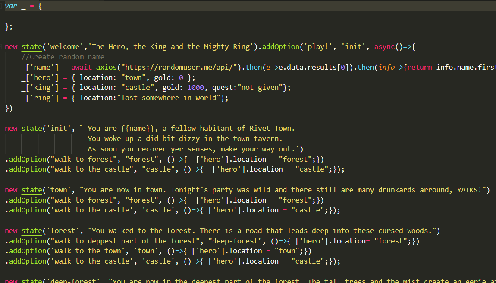

The Hero, The King & The Mighty Ring
====================================

This is a simple self-exercise to create a simple game using the most simple finite state machine. In the game the hero has to find the king's lost ring and return to him to receibe the reward.

The game is implemented using plain simple JavaScript, implemmenting a "State" "class" with conditional options that deppending of the game state drives you to one state or other. You may find the whole development in the [game.js](js/game.js)

You may play a web version of the mini-game in the [[**online demo**]](https://h3r.github.io/The-Hero-The-King-and-the-Mighty-Ring/).

The following diagram represents how complex this may become even for a simple quest like this. (ok i added some unnecesary fluff :'D)

