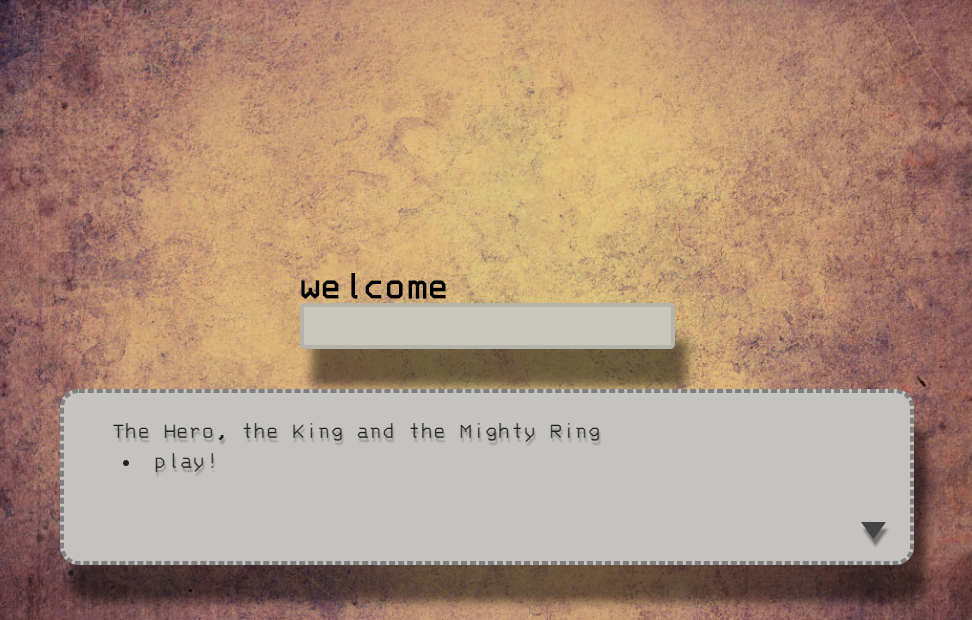
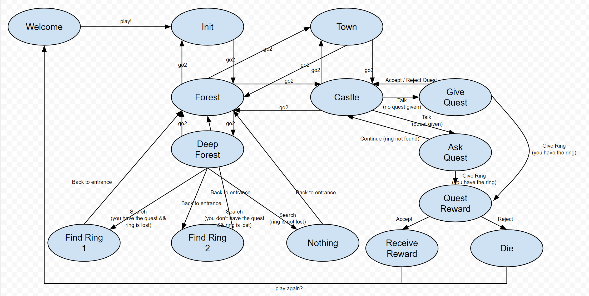

The Hero, The King & The Mighty Ring
====================================

This is a simple finite state machine to represent a simple quest game where the hero has to find the king's lost ring and return to him to receibe the reward.

This game is implemented using plain simple JavaScript, implemmenting a "State" "class" with conditional options that deppending of the game state drives you to one state or other. You may play a web version of the mini-game in the [[**online demo**]](https://h3r.github.io/The-Hero-The-King-and-the-Mighty-Ring/).

The following diagram represents how complex this may become even for a simple quest like this. (ok i added some unnecesary fluff :'D)

